<div align="center">

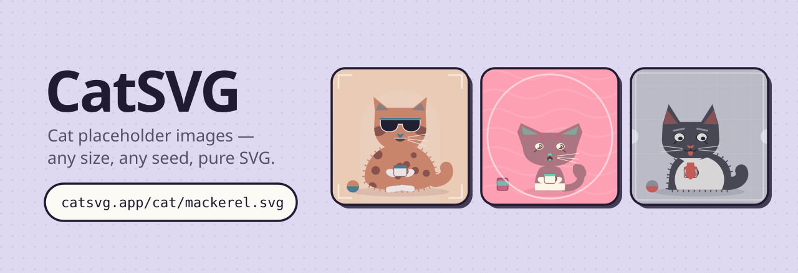

<br>

**[catsvg.app](https://catsvg.app)** · every URL is a cat

[](LICENSE)


</div>

A cat-based image placeholder service. Every URL is a cat, rendered as pure SVG
by a deterministic generator — no image files, no storage, no network calls.

```html

```

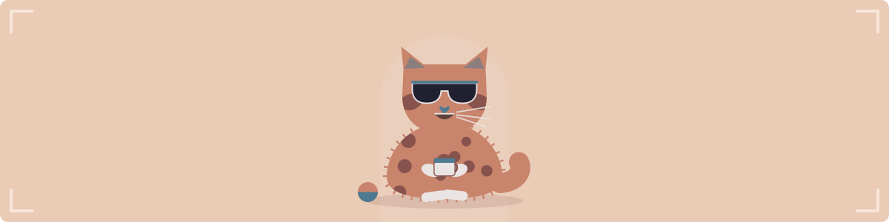

Same seed, same cat, forever.

---

## One word in, one cat out

The seed is any string you like. Feed it the same word tomorrow and you get the
same cat, down to the whiskers.

<div align="center">
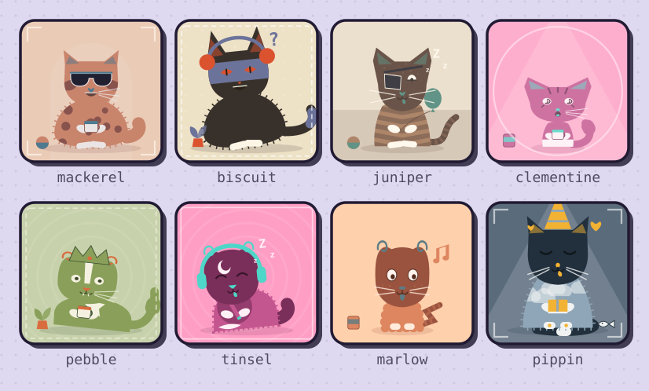
</div>

```
/cat/mackerel.svg      /cat/clementine.svg      /cat/marlow.svg
/cat/biscuit.svg       /cat/pebble.svg          /cat/pippin.svg
```

Ask for `random` instead and you get a fresh cat on every request.

---

## Any size, any shape

Sizes run from 16 to 2000 pixels a side. Nothing is cropped or letterboxed: the
cat is drawn in a fixed 400×400 art space, and wider output extends the visible
frame sideways while taller output extends it upward, keeping the cat's feet
near the bottom edge. Backgrounds, tints and frames paint the whole frame.

<table>
<tr>
<td width="50%" align="center">
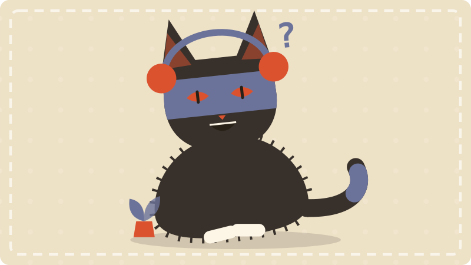<br>
<code>/cat/800x450/biscuit.svg</code>
</td>
<td width="25%" align="center">
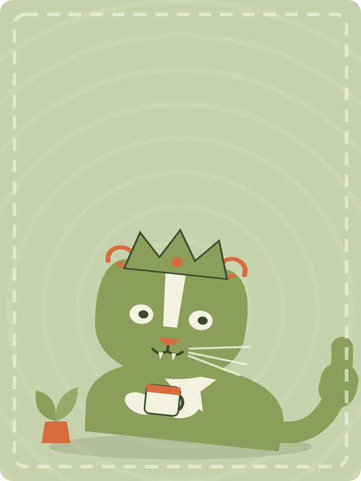<br>
<code>/cat/600x800/pebble.svg</code>
</td>
<td width="25%" align="center">
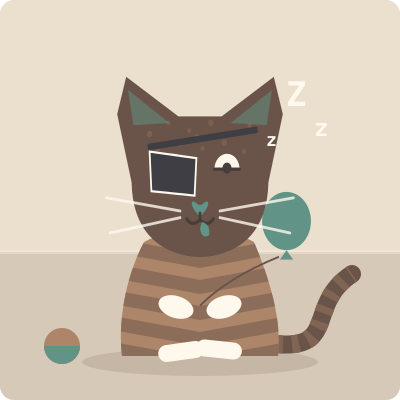<br>
<code>/cat/400/juniper.svg</code>
</td>
</tr>
</table>

---

## Six presets

A preset narrows the pool a cat is rolled from. Everything it does not mention
still rolls free.

<div align="center">
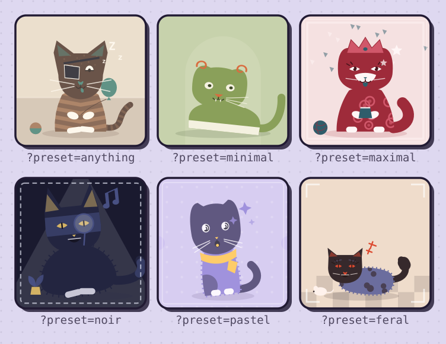
</div>

---

## Pin any trait

Twenty-five traits make up a cat, and any of them can be pinned from the query
string. Here is one seed — `maple` — with a single trait changed each time.

<div align="center">
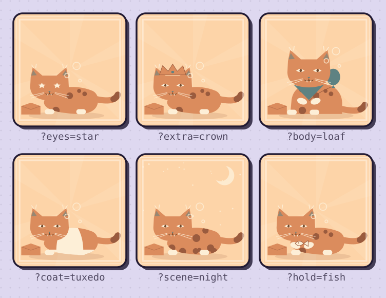
</div>

```
/cat/400/maple.svg?eyes=star
/cat/400/maple.svg?extra=crown&palette=neon&body=loaf
```

<details>
<summary>All 25 trait names</summary>

`palette`, `tone`, `body`, `size`, `posture`, `coat`, `fluff`, `face`, `head`,
`ears`, `eyes`, `lashes`, `nose`, `mouth`, `whiskers`, `tail`, `tailtip`,
`paws`, `extra`, `hold`, `prop`, `aura`, `scene`, `tint`, `frame`

Unknown names and invalid values are ignored, so a pinned trait can never break
an image. The pools live in [`src/cat/spec.ts`](src/cat/spec.ts).

</details>

---

## Cats as avatars

Pass a user id, a username or an email hash as the seed and everybody gets their
own stable cat — an identicon, but a cat.

<div align="center">
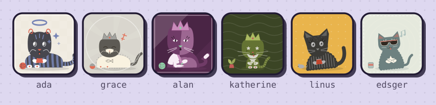
</div>

```html

```

---

## Postcards

`/cat/postcard/…` mounts the same generated cat on a paper card. The **front**
is the picture side: the cat in a window with a greeting printed under it. The
**back** is the written side — a message, a stamp carrying a miniature of the
same cat, a postmark, the address rules and the cat's signature.

<table>
<tr>
<td width="50%" align="center">
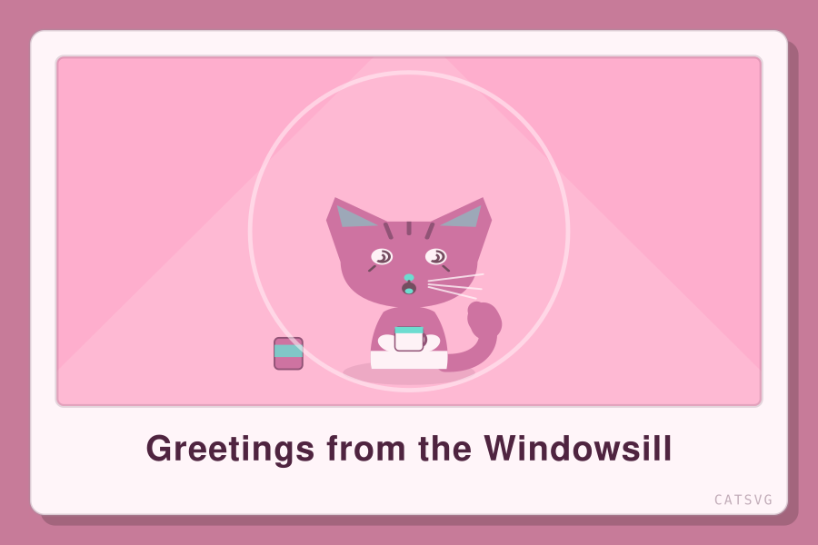<br>
<code>/cat/postcard/900x600/clementine.svg</code>
</td>
<td width="50%" align="center">
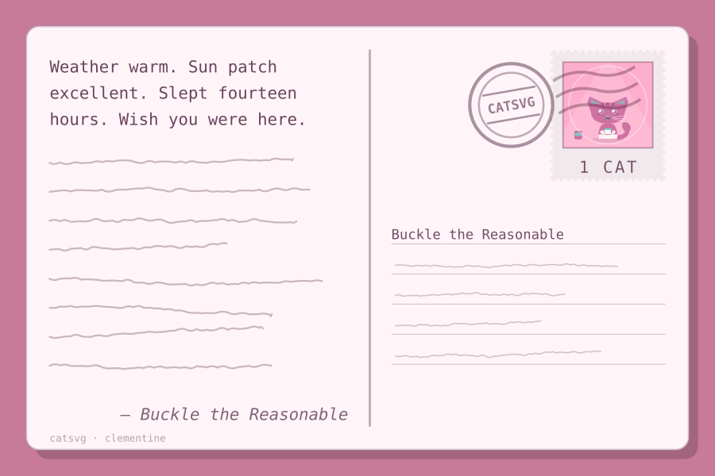<br>
<code>/cat/postcard/back/900x600/clementine.svg</code>
</td>
</tr>
</table>

Every field on the card is a query parameter — and every one of them has an
answer the cat writes itself from the seed, so a postcard is fully written
whether you fill nothing in or all of it.

| Field | Where it lands | Left empty |
| --- | --- | --- |
| `text` | The greeting (front) or the message (back) | The cat picks where it is writing from, or what it has to report |
| `caption` | Small print under the greeting | Nothing |
| `to` | The first address line | The cat's own name |
| `from` | The signature | The cat's own name |
| `postmark` | Inside the postmark ring | `CATSVG`, or the cat's place when unbranded |

```
/cat/postcard/900x600/mackerel.svg?text=Greetings%20from%20Hull&caption=est.%202026
/cat/postcard/back/900x600/mackerel.svg?text=Send%20fish&to=Sheehan&from=The%20Cat
```

<details>
<summary>Sides, sizes, stamps and branding</summary>

`postcard`, `front` and `back` are path segments in any order, and
`?mode=postcard` / `?side=back` do the same job from the query string. A
postcard with no size is 3:2 landscape (600×400) rather than square, and a
single size segment keeps that ratio — `/cat/postcard/300/…` is 300×200.

`?stamp=` is a count, not a switch: one stamp by default, up to five in a row,
or none at all. They are right-aligned along the top of the address side and
shrink to fit however many were asked for, and the postmark cancels the end of
the row — so a full row gets it landed across the stamps the way a real one
does. `?stamp=off` (or `0`) leaves the card unfranked and the address rules take
the room back.

`?brand=off` drops every CatSVG mark — the wordmark in the corner of the front,
the footer on the back, and the `CATSVG` in the postmark, which becomes the
place the cat is writing from instead. It reads `0`, `false`, `off` or `no`.

```
/cat/postcard/back/900x600/mackerel.svg?stamp=3          # a row of three
/cat/postcard/back/900x600/mackerel.svg?stamp=off        # unfranked
/cat/postcard/back/900x600/mackerel.svg?brand=off        # nothing says catsvg
```

Everything else still applies: seeded postcards are pure functions of their URL,
so they cache for a year, and `random` still rolls a fresh cat per request.

</details>

---

## URL API

| URL | What you get |
| --- | --- |
| `/cat/mackerel.svg` | Seeded cat, 400×400 |
| `/cat/240/mackerel.svg` | Square at 240px |
| `/cat/1200x300/mackerel.svg` | Any `width x height`, 16–2000px each |
| `/cat/320/240/mackerel.svg` | Two numeric segments work too |
| `/cat/320x320/random.svg` | A different cat every request (`no-store`) |
| `/cat/400?seed=biscuit` | Query form — same thing |
| `/cat/postcard/mackerel.svg` | The same cat as a postcard, 600×400 |
| `/cat/postcard/back/mackerel.svg` | The written side of it |

`/i/…` and `/cats/…` are accepted as aliases of `/cat/…`, and the `.svg` suffix
is optional.

### Query parameters

| Param | Effect |
| --- | --- |
| `seed`, `s` | Any string. `random` (or no seed) rolls a fresh cat. |
| `w`, `h` (`width`, `height`) | Size override, clamped to 16–2000. |
| `preset` | `anything` · `minimal` · `maximal` · `noir` · `pastel` · `feral` |
| `mode` | `cat` (default) or `postcard`. |
| `side` | `front` or `back` — the two sides of a postcard. |
| `text` | Caption pill on a cat; the greeting or message on a postcard. |
| `caption` | Small line under the greeting, postcard front. |
| `to`, `from` | Addressee and signature, postcard back. |
| `postmark` | Words in the postmark ring, up to 12 characters. |
| `stamp` | How many stamps frank the back, 0–5. Default 1. |
| `brand` | `brand=off` drops every CatSVG mark. |
| *any trait name* | Pin one trait: `?eyes=star&palette=neon&body=loaf` |

### Response

`image/svg+xml; charset=utf-8`, `Access-Control-Allow-Origin: *`, and an
`X-Cat-Seed` header naming the seed used. Seeded cats are a pure function of
their URL, so they are served `public, max-age=31536000, immutable`; `random`
cats are `no-store`.

---

## The studio

`/` is the studio: roll cats, lock traits you like, pick a preset, type a seed,
tinker with any single trait, save favourites (localStorage), and export SVG,
PNG or a 3×3 contact sheet. The **Postcard** toggle turns whatever is on the
stage into a card, flips between its two sides and lets you write every field on
it — greeting, caption, addressee, signature, postmark, how many stamps, and
whether the CatSVG marks are there at all. The exports and the URL follow it.

The **Cat URL** panel gives you the image URL for whatever is on screen, an
`` snippet and a markdown snippet, plus a field where you can paste any cat
URL back in to preview and load it. The page URL always describes the current
cat, so it is shareable as-is.

### Sending one

**Share**, under the cat, sends whatever is on the stage wherever the device can
send things.

On a phone or a tablet — and in desktop Safari and Chrome — that is the system
share sheet, handed a 1200px PNG as a file. Messages, Mail, WhatsApp and the rest
then put the picture itself in the draft rather than a link that may not render.
A postcard goes as both of its sides, because a card someone wrote on is only
half a card without its back.

Where there is no share sheet, the `⋯` menu is the fallback, and it is always
there on purpose:

| Item | What it does |
| --- | --- |
| Email a draft | Opens a `mailto:` draft with the link, and copies the PNG so it can be pasted into the body |
| Messages | Opens an `sms:` draft with the link |
| Copy link | The studio URL for this exact cat or card |
| Copy image | The PNG on the clipboard |
| Download PNG / both sides | The same 1200px raster as files |

A `mailto:` body is plain text, so nothing can embed an image in the draft
itself — hence the clipboard copy alongside it, and hence the file share being
the preferred path wherever the device offers one.

`catShareTarget()` in `src/app/share.ts` builds one `ShareTarget` from a recipe
and every target above is derived from it, postcard fields included.

---

## Running it

```bash
bun install
bun run dev            # app + image endpoint on http://localhost:5180
bun run test           # vitest
bun run typecheck
bun run build          # tsc + vite build
bun run images         # regenerate the favicon, touch icon and social card
bun run readme:images  # regenerate the pictures in this README
bun run art:audit      # render every part + a 25-cat QA atlas to /tmp/catsvg-audit
```

`bun run dev` serves the SPA *and* the `/cat/*` image endpoint through the same
Vite plugin (`catApi` in `vite.config.ts`), so local URLs behave exactly like the
deployed edge function.

### Layout

```
src/cat/        the generator — pure, dependency-free, runs in browser or edge
  rng.ts        seeded hash + PRNG (same seed ⇒ same cat)
  spec.ts       trait pools, presets, labels
  traits.ts     makeTraits / catName / newSeed
  render.ts     renderCat, renderSheet, catArt, frame maths
  postcard.ts   renderPostcard — the same cat, mounted on a card
  url.ts        parseCatUrl / buildCatPath / buildStudioQuery / renderCatRequest
  *.ts          the art: bodies, tails, heads, face, coats, accessories, scenes
src/server/     handler.ts — URL ⇒ SVG response (status, body, headers)
src/app/        the React studio
src/seo/        site copy, meta + JSON-LD, sitemap, the crawler-facing prerender
  analytics.ts  the optional Umami tag, from env vars — absent when unset
api/cat.ts      Vercel edge function wrapping the handler
scripts/        brand images and the README artwork, drawn by the generator
docs/readme/    the pictures on this page — regenerate, never hand-edit
```

Every picture in this README is real output: `scripts/readme-images.ts` renders
the plain examples by handing the documented URL to the same parser the service
uses, and builds the labelled grids out of the same `catArt` the endpoint draws.

---

## Deploying

Vercel, no configuration beyond the checked-in `vercel.json`, which rewrites
`/cat/*`, `/cats/*` and `/i/*` to the edge function in `api/cat.ts`.

```bash
vercel deploy
```

`catsvg.app` is the canonical origin. `catsvg.dev`, both `www` hosts and the
`catsvg.vercel.app` deploy URL are 308 redirects onto it, configured as project
domains on Vercel rather than in this repo.

### Analytics — optional

Two environment variables, read at build time by `vite.config.ts` and baked into
the `<head>`. Set neither and the built page has no third-party script on it at
all, which is what a fork or a local dev server gets.

| Variable | What it does |
| --- | --- |
| `UMAMI_WEBSITE_ID` | The [Umami](https://umami.is) site id. Nothing is emitted without it. |
| `UMAMI_SCRIPT_URL` | A self-hosted instance's `script.js`. Defaults to Umami Cloud. |

```bash
vercel env add UMAMI_WEBSITE_ID production
vercel env add UMAMI_SCRIPT_URL production
```

The tag carries `data-domains="catsvg.app"`, derived from `SITE_URL`, so preview
deployments and localhost load the script but report nothing — the numbers stay
production-only. Copy `.env.example` to `.env.local` to try it locally.

<details>
<summary>Being found — how the SPA stays crawlable</summary>

The studio is a client-rendered SPA, so a crawler that does not run JavaScript
would otherwise see an empty `#root` — and most answer-engine crawlers do not run
JavaScript. `src/seo` is the fix, and the single source of truth for everything
the site says about itself:

| File | What it owns |
| --- | --- |
| `site.ts` | Title, description, intro, FAQ, snippets, example gallery |
| `html.ts` | `<head>` tags, Open Graph / Twitter cards, JSON-LD, sitemap, robots.txt |
| `shell.ts` | The static HTML injected into `#root` at build time |
| `analytics.ts` | The optional Umami tag — see [Analytics](#analytics--optional) |

The `seo` plugin in `vite.config.ts` injects the head and the prerender into
`index.html`, and emits `sitemap.xml` and `robots.txt`. The same `site.ts`
constants feed the React `ApiDocs` and `Faq` components, so what a crawler reads
and what a visitor sees cannot drift apart.

`SITE_URL` in `site.ts` is the one place the canonical origin is written down —
canonical links, Open Graph URLs, JSON-LD ids, the sitemap, the robots.txt
`Sitemap:` line and every copy-paste snippet are derived from it.

Structured data is one `@graph`: `WebSite`, `WebApplication`, `WebPage`,
`FAQPage` and the author. Every generated cat carries a `<title>` and `<desc>`
naming it, so inline SVGs are readable to screen readers too.

`bun run images` regenerates `public/favicon.svg`, `public/apple-touch-icon.png`
and the 1200×630 `public/og.png` social card — all drawn by the same generator
that serves the API.

</details>

---

## License

[MIT](LICENSE) © 2026 Tim Mikeladze. The cats it draws are plain SVG with no
third-party artwork in them — use them anywhere, commercially included, no
attribution required.

## Credits

Created by [Tim Mikeladze](https://linesofcode.dev) —
[linesofcode.dev](https://linesofcode.dev) · [@linesofcode](https://x.com/linesofcode)

<div align="center">
<br>

</div>
